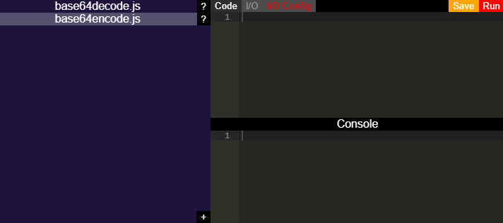

# ScriptCaddy 

  

ScriptCaddy is a specialized IDE for cataloging, developing and running short throwaway or regularly useful scripts. How data gets in and out of a script is handled by I/O (input/output) fields configured within the app so you can immediately focus on your script's logic. ScriptCaddy also keeps all of your scripts in one place so they never get lost.

Need to quickly convert some JSON to CSV? Need to convert a unix timestamp to ISO 8601? Need to build a URL from some set of data inputs? Put ScriptCaddy in your developer's toolbelt and reach for it whenever you need it.

## Feature Roadmap

* Provide interface for installing/uninstalling external packages (npm packages)
* Better themes
* New I/O field features and types
  * Easily load inputs from files or save outputs to files
  * Simple field validations (numbers only, JSON, password)
  * Dropdowns, check boxes, radio buttons
  * GUI editor for I/O config
* Global library of scripts you can download from and contribute to
* Support Python and other scripting runtimes
* Internationalization / Localization

## Code of Conduct

[Code of Conduct](CODE_OF_CONDUCT.md)

## Contribution Guidelines

[Contribution Guidelines](CONTRIBUTING.md)

## License

[GNU General Public License v3.0](LICENSE)
