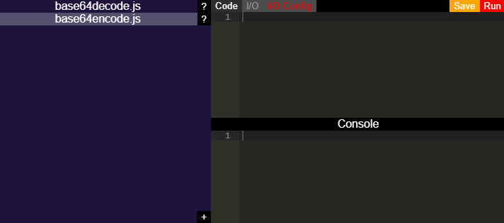

   
  

# ScriptCaddy

ScriptCaddy is a specialized IDE for cataloging, developing and running short throwaway or othwerwise useful scripts. How data gets in and out of a script is handled by I/O (input/output) fields configured within the app so you only need to focus on script logic. ScriptCaddy also keeps all of your scripts in one place so they never get lost.

  

Need to quickly convert some JSON to CSV? Need to convert a unix timestamp to ISO 8601? Need to build a URL from some set of data inputs? Put ScriptCaddy in your developer toolbelt and reach for it whenever you need it.

## Help Wanted

I built this because I always wanted a "go to" place where I could access my own personal collection of mini-scripts for various one off operations I find myself doing from time to time. Currently there is a lot to be improved on especially when it comes to the UI and various features. I'm looking for some partner contibutors who'd like to get in on the ground floor of building out what I think could be an incredible tool for developers. If you'd like to chat hit me up on Discord at: foxtrotwhiskey9#6517

## Feature Roadmap

* Signed binaries for Mac and Windows
  * Currently to run the pre-built binaries you must explicitly opt-out of code signing verification on Mac and Windows.
* Provide interface for installing/uninstalling external packages (npm packages)
* Improved UI / Themes
* New I/O field features and types
  * Easily load inputs from files or save outputs to files
  * Simple field validations (numbers only, JSON, password)
  * Dropdowns, check boxes, radio buttons
  * GUI editor for I/O config
* Global library of scripts you can download from and contribute to
* TypeScript support (including IDE hints)
* Support Python and other scripting runtimes
* Internationalization / Localization

## Code of Conduct

[Code of Conduct](CODE_OF_CONDUCT.md)

## Contribution Guidelines

[Contribution Guidelines](CONTRIBUTING.md)

## License

[GNU General Public License v3.0](LICENSE)
